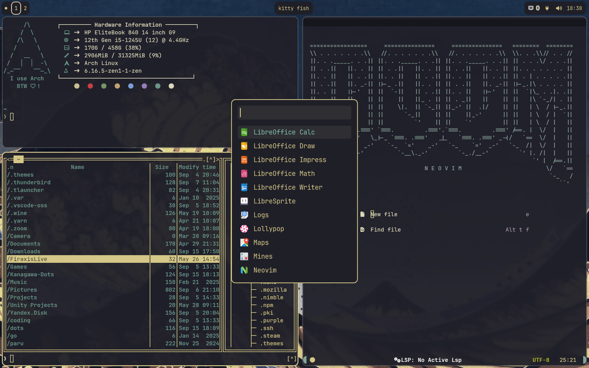
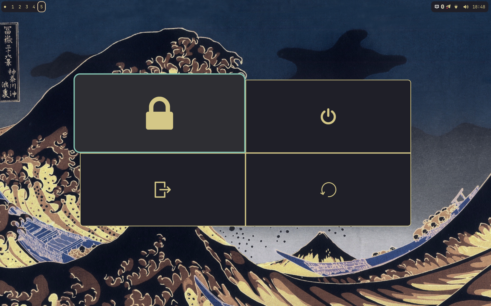

# Kanagawa-Dots
Based on [Kanagawa](https://github.com/rebelot/kanagawa.nvim) and [Kanagawa-paper](https://github.com/thesimonho/kanagawa-paper.nvim)

## Configs:
- fish
- gtk
- hypland
- hyprlock
- hyprpaper
- rofi
- waybar
- wlogout
- neofetch
- nvim
- midnight-commander
